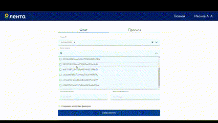

<h1 align="center">Lenta Project</h1>

Проект представляет собой сайт магазина Лента для внутренних пользователей (сотрудников), на котором можно рассчитать прогноз по продажам, а также посмотреть инфографику по фактическим продажам.

Проект создан @snurnisyan и @vlad-lis во время участия в хакатоне Лента х Яндекс Практикум.

Проект создан совместно в команде с дизайнерами, backend-разработчиками и data science.


------

<h3 align="center">Реализованные страницы</h2>

1. Авторизация (валидация полей формы, упрощенная авторизация с возможностью сохранения данных, а также выход из профиля).
2. Фильтры (для фактических и прогнозных данных + также реализована возможность сохранять настройки фильтров).
3. Таблицы (для фактических и прогнозных данных).
4. Графики (для фактических и прогнозных данных).
5. Модальные окна (для фильтров и смены пользователя).


------

<h3 align="center">Основные технологии проекта</h2>

1. **HTML и SCSS.** Соблюдается корректная семантика тегов и продвинутая стилизация.
2. **React (React-router v.6).** Компонентная сборка, реализовано открытие и закрытие модальных окон, авторизация, роутинг (в т.ч. с динамическим url).
3. **Redux Toolkit (Thunk).** Используется хранилище Redux для хранения данных с API и работы с глобальным контекстом.
4. **Typescript.** Весь код протипизован, в т.ч. и Redux хранилище.
5. **Chart.js, react-table, react-chart.js, react-select, react-datepicker.** Для визуализации инфографики и стилизации полей формы.
6. **ESLint**. Линтер для анализа стиля кода.


------

<h3 align="center">Запуск проекта</h2>

Проект создан с помощью **<a href="https://vitejs.dev/">Vite</a>**

Проект запускается локально по адресу http://localhost:5173/ путем клонирования данного репозитория и последовательного запуска команд в терминале.

Предварительно должны быть установлены программы Git, NodeJS и менеджер пакетов npm.


```
// clone repo
git clone https://github.com/Hackathon-Lenta-Team2/frontend

// go to dir
cd frontend

// install dependencies
npm install

// build project
npm run build

// run dev mode
npm run dev

// run preview Vite mode
npm run preview


```
